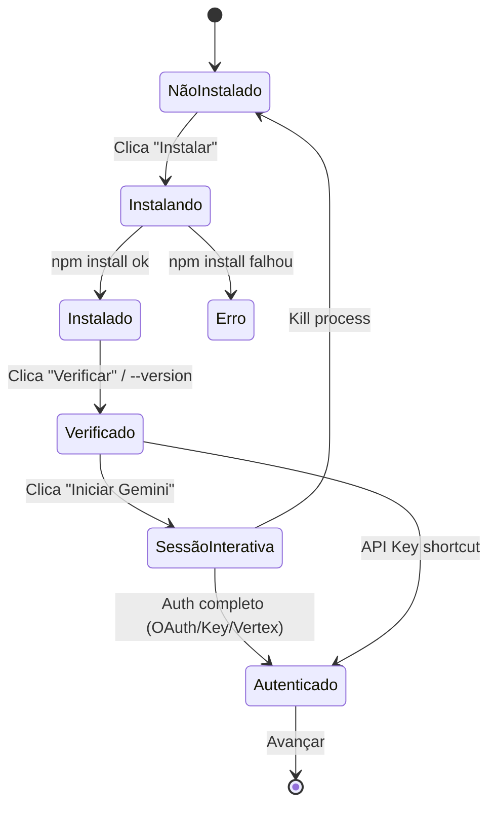
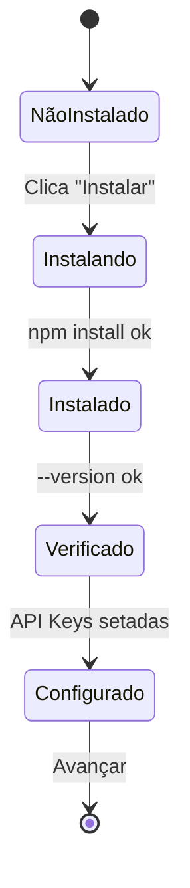
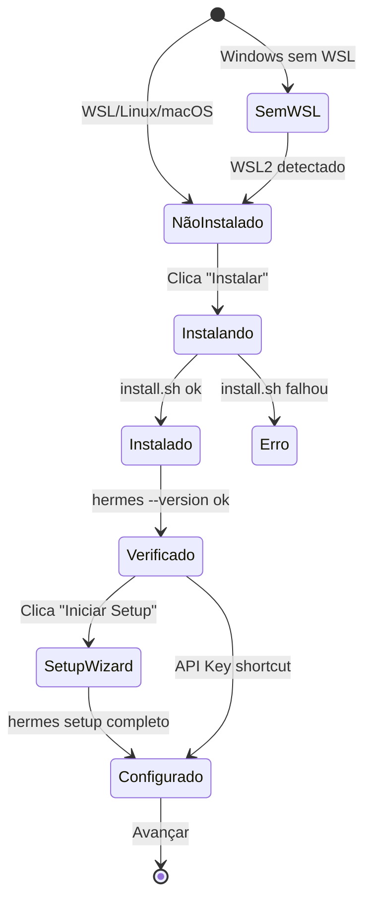

# 004 — Engine Orchestration Rework: Design

## 1. Visão Geral da UI

**Vibe**: Dashboard/Sistema gerencial → **Liquid Glass + Acessibilidade** (per skill `ux-ui-architect-2026`).

O StepEngine será um wizard de 3 sub-etapas por engine, com um terminal interativo central que é o coração da experiência.

```
┌─────────────────────────────────────────────────┐
│            Conexão Agnóstica de Motor            │
│     Instale, verifique e ative seu motor IA      │
├──────────┬──────────┬──────────┤                │
│ Gemini   │ OpenClaw │ Hermes   │  ← Engine Cards│
│   CLI ✓  │          │  (Go)    │                │
├──────────┴──────────┴──────────┤                │
│                                                  │
│ ┌────────────────────────────────────────┐      │
│ │ Status: Instalado v0.40.1              │      │
│ │ Auth: Não autenticado                  │      │
│ └────────────────────────────────────────┘      │
│                                                  │
│ ┌──────────┐ ┌──────────┐ ┌──────────────┐      │
│ │ Instalar │ │ Verificar│ │ Iniciar CLI  │      │
│ └──────────┘ └──────────┘ └──────────────┘      │
│                                                  │
│ ─── OU configurar via API Key ───                │
│ ┌──────────────────────────────────────┐        │
│ │ GEMINI_API_KEY: [________________]   │        │
│ │        [Configurar e Iniciar]        │        │
│ └──────────────────────────────────────┘        │
│                                                  │
│ ┌──── Terminal Interativo ─────────────┐        │
│ │ ● ● ●  Nexus Terminal               │        │
│ │                                      │        │
│ │ $ gemini --version                   │        │
│ │ v0.40.1                              │        │
│ │                                      │        │
│ │ $ gemini                             │        │
│ │ ? How would you like to authenticate?│        │
│ │ ❯ Sign in with Google                │        │
│ │   Use Gemini API key                 │        │
│ │   Use Vertex AI                      │        │
│ │                                      │        │
│ │ > [___________________________] Send │        │
│ └──────────────────────────────────────┘        │
│                                                  │
│            [Avançar: Conectar Vault →]           │
└─────────────────────────────────────────────────┘
```

---

## 2. Componentes UI

### 2.1 Engine Selector Cards (existente, manter)
- Grid 3 colunas com cards glassmórficos
- Borda neon teal no card ativo
- Ícones: Terminal (Gemini), Cpu (OpenClaw), Code2 (Hermes)
- **Novo**: Badge de status no card (Instalado/Não instalado/Autenticado)

### 2.2 Status Banner (novo)
- Barra horizontal com ícones de status
- 3 indicadores: Instalação | Autenticação | Conexão
- Cores: `var(--text-muted)` (pendente), `var(--primary)` (ok), `var(--accent)` (warning)
- Estilo: `glass-panel` sutil

### 2.3 Action Bar (refatorado)
- 3 botões: **Instalar** | **Verificar** | **Iniciar CLI**
- Cada botão mostra estado (idle, loading, success, error)
- Loading: spinner inline
- Success: checkmark verde
- Estilo: `btn-ghost` com bg-white/5

### 2.4 API Key Shortcut Panel (novo)
- Seção colapsável "Ou configurar via API Key"
- Input `type="password"` para a key
- Select dropdown para tipo: `GEMINI_API_KEY` | `GOOGLE_API_KEY + Vertex`
- Botão "Configurar e Iniciar"
- Estilo: `glass-panel` com borda dashed

### 2.5 Interactive TerminalBlock (refatorado)
- **Novo**: Input field na parte inferior do terminal
- **Novo**: Botão "Send" ou Enter para enviar stdin
- **Novo**: Conexão SSE para streaming em tempo real
- **Novo**: Botão "Parar" (kill process) integrado no header
- Auto-scroll, strip ANSI codes
- Fonte: JetBrains Mono
- Cores por tipo: prompt (teal), stdout (white), stderr (amber), error (red), success (green)

---

## 3. Design Tokens (Liquid Tactical Noir — manter)

```css
/* Superfícies Glassmórficas */
.glass-panel {
  background: rgba(255, 255, 255, 0.03);
  backdrop-filter: blur(16px);
  border: 1px solid rgba(255, 255, 255, 0.06);
  border-radius: 16px;
  box-shadow:
    0 1px 2px rgba(0,0,0,0.07),
    0 4px 8px rgba(0,0,0,0.07),
    0 16px 32px rgba(0,0,0,0.07),
    inset 0 1px 0 rgba(255,255,255,0.05);
}

/* Terminal Interativo */
.terminal-block {
  background: rgba(0, 0, 0, 0.6);
  border: 1px solid rgba(255, 255, 255, 0.08);
  border-radius: 12px;
  font-family: 'JetBrains Mono', monospace;
  font-size: 0.8125rem; /* 13px */
}

.terminal-input {
  background: rgba(255, 255, 255, 0.04);
  border-top: 1px solid rgba(255, 255, 255, 0.06);
  padding: 8px 12px;
  color: #00F5E6;
  font-family: 'JetBrains Mono', monospace;
  font-size: 0.8125rem;
}

/* Status Badges */
.status-pending { color: var(--text-muted); }
.status-active { color: var(--primary); text-shadow: 0 0 8px rgba(0,245,230,0.3); }
.status-error { color: #EF4444; }

/* Action Buttons */
.btn-action {
  display: flex;
  align-items: center;
  gap: 6px;
  padding: 8px 16px;
  border-radius: 10px;
  font-size: 0.8125rem;
  font-weight: 500;
  transition: all 0.3s cubic-bezier(0.4, 0, 0.2, 1);
}

.btn-action:hover {
  transform: translateY(-1px);
  box-shadow: 0 4px 12px rgba(0, 245, 230, 0.15);
}
```

---

## 4. Microinterações

| Elemento | Trigger | Animação |
|----------|---------|----------|
| Engine Card | Hover | `translateY(-2px) scale(1.02)` + glow border |
| Engine Card | Select | Border pulse neon teal + checkmark fade-in |
| Action Button | Click | Scale down `0.97` + spinner appear |
| Action Button | Success | Spinner → checkmark morph (300ms) |
| Terminal Line | New output | Slide-in from bottom (100ms) |
| Terminal Input | Focus | Border glow teal + cursor blink |
| Status Badge | Change | Color transition 300ms + subtle pulse |
| Success Panel | Appear | Scale from 0.95 + fade-in (400ms) |

---

## 5. Arquitetura Backend

### 5.1 Process Manager (`engine.ts`)

```
ProcessManager
├── sessions: Map<string, ManagedProcess>
│   ├── id: string (UUID)
│   ├── process: ChildProcess
│   ├── command: string
│   ├── startedAt: Date
│   └── subscribers: SSE Response[]
├── spawn(cmd, args, env?) → sessionId
├── sendInput(sessionId, text) → void
├── kill(sessionId) → void
└── subscribe(sessionId, res) → void
```

### 5.2 Endpoints Novos

| Endpoint | Método | Corpo | Retorno |
|----------|--------|-------|---------|
| `/api/setup/spawn` | POST | `{command, args, env?}` | `{sessionId}` |
| `/api/setup/stream/:id` | GET (SSE) | — | Stream de `{type, data}` |
| `/api/setup/input/:id` | POST | `{input}` | `{success}` |
| `/api/setup/kill/:id` | POST | — | `{success}` |

### 5.3 SSE Event Format
```
event: stdout
data: {"text": "? How would you like to authenticate?"}

event: stderr
data: {"text": "warning: ..."}

event: exit
data: {"code": 0}
```

### 5.4 Whitelist de Segurança
```typescript
const ALLOWED_COMMANDS = ['npm', 'npx', 'gemini', 'openclaw', 'go', 'node'];
```

---

## 6. Banco de Dados (Supabase/Prisma)

### Sem mudanças no schema
O onboarding salva configs no model `Config` existente:

| Key | Value (exemplo) | Descrição |
|-----|-----------------|-----------|
| `engine` | `gemini-cli` | Engine ativa |
| `gemini_authed` | `true` | Flag de auth do Gemini |
| `api_key` | `sk-...` | API key (encriptada) |
| `engine_version` | `0.40.1` | Versão detectada |

---

## 7. Fluxo por Engine

### Gemini CLI


### OpenClaw


### Hermes Agent (Nous Research)


---

## 8. Acessibilidade (WCAG 2.2)

- **Foco visível**: Todos os botões e inputs com `:focus-visible` (outline 2px teal)
- **Contraste**: Texto branco (#FAFAFA) sobre zinc-950 = ratio 15.4:1 ✓
- **Alvos de toque**: Botões mínimo 44x44px
- **Semântica**: `<form>`, `<label>`, `aria-label` no terminal input
- **Teclado**: Tab navigation completa, Enter para enviar input no terminal
